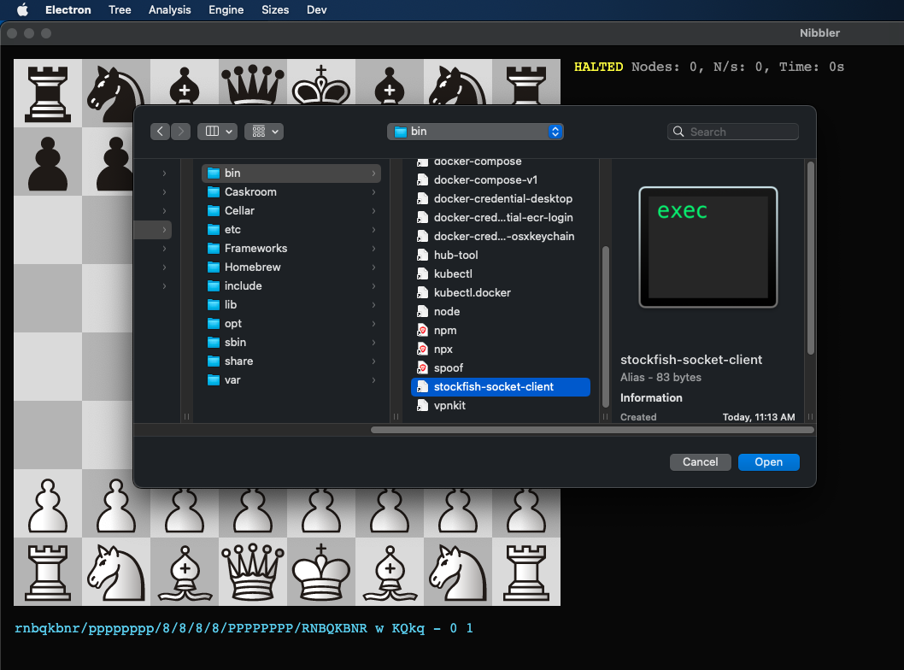
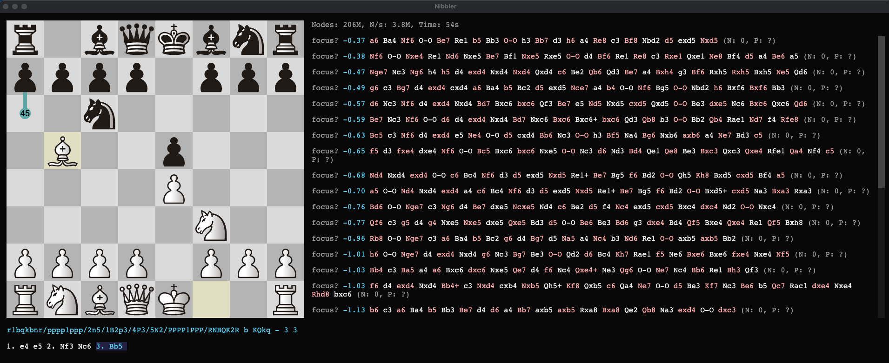

# stockfish-socket-client
Node.js client for connecting to [stockfish-socket-server](https://github.com/x64squares/stockfish-socket-server)

## Installation

1. Configure your `~/.npmrc` file for authentication with Github Packages using a Personal Access Token:
```
//npm.pkg.github.com/:_authToken=YOUR_ACCESS_TOKEN
@x64squares:registry=https://npm.pkg.github.com
```

2. Install using `npm`:
```bash
npm install -g @x64squares/stockfish-socket-client
```

3. Check installation
```
$ stockfish-socket-client --help
Usage: stockfish-socket-client [options]

Options:
  -V, --version       output the version number
  --server-url <url>  URL of the stockfish-socket-server
  -h, --help          display help for command
```

## Usage

### Command line mode
The `--server-url` command line option is the simplest way to connect to a server and use the client in command line mode:
```
$ stockfish-socket-client --server-url http://127.0.0.1:5000
Stockfish 15 by the Stockfish developers (see AUTHORS file)
isready
readyok
position startpos moves e2e4 e7e5
go depth 5
info string NNUE evaluation using nn-6877cd24400e.nnue enabled
info depth 1 seldepth 1 multipv 1 score cp 41 nodes 32 nps 32000 tbhits 0 time 1 pv g1f3
info depth 2 seldepth 2 multipv 1 score cp 164 nodes 63 nps 63000 tbhits 0 time 1 pv g1f3 a7a6 f3e5
info depth 3 seldepth 3 multipv 1 score cp 148 nodes 139 nps 139000 tbhits 0 time 1 pv d1h5 a7a6 h5e5 g8e7
info depth 4 seldepth 4 multipv 1 score cp 148 nodes 214 nps 107000 tbhits 0 time 2 pv d1h5 a7a6 h5e5 g8e7
info depth 5 seldepth 5 multipv 1 score cp 75 nodes 1308 nps 436000 tbhits 0 time 3 pv g1f3 g8f6 d2d4 f6e4
bestmove g1f3 ponder g8f6
```

### Integration with Chess GUI programs
The client integrates with any UCI-Compatible chess GUI program (such as [Arena](http://www.playwitharena.de/) and [Nibbler](https://github.com/rooklift/nibbler)). As most GUI programs do not have any option to specify command line arguments for engines, the server URL can also be specified with a configuration file located in `${HOME}/.config/stockfish_socket_client/config.json`; the configuration file must be in the following format:
```json
{
    "serverUrl": "http://123.456.7.8:5000"
}
```

Following the server configuration setup, the client can be selected as the engine in the GUI program like so:

#### Engine selection:




#### Running analysis:

